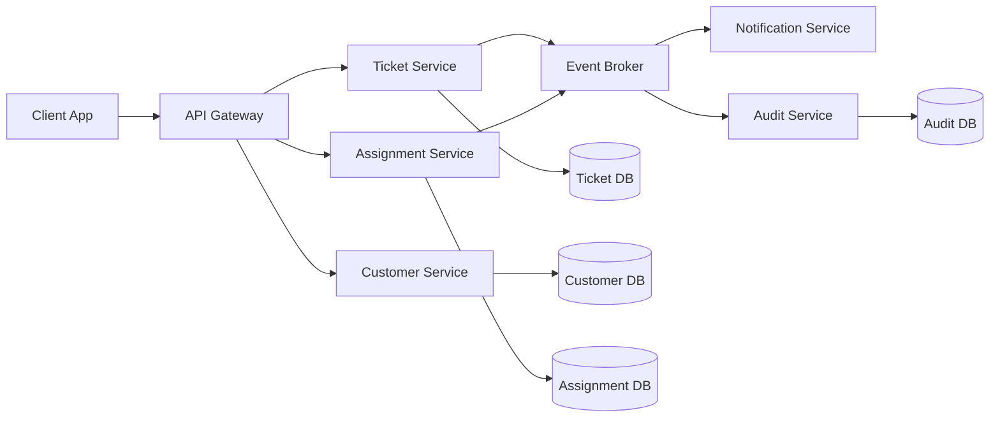
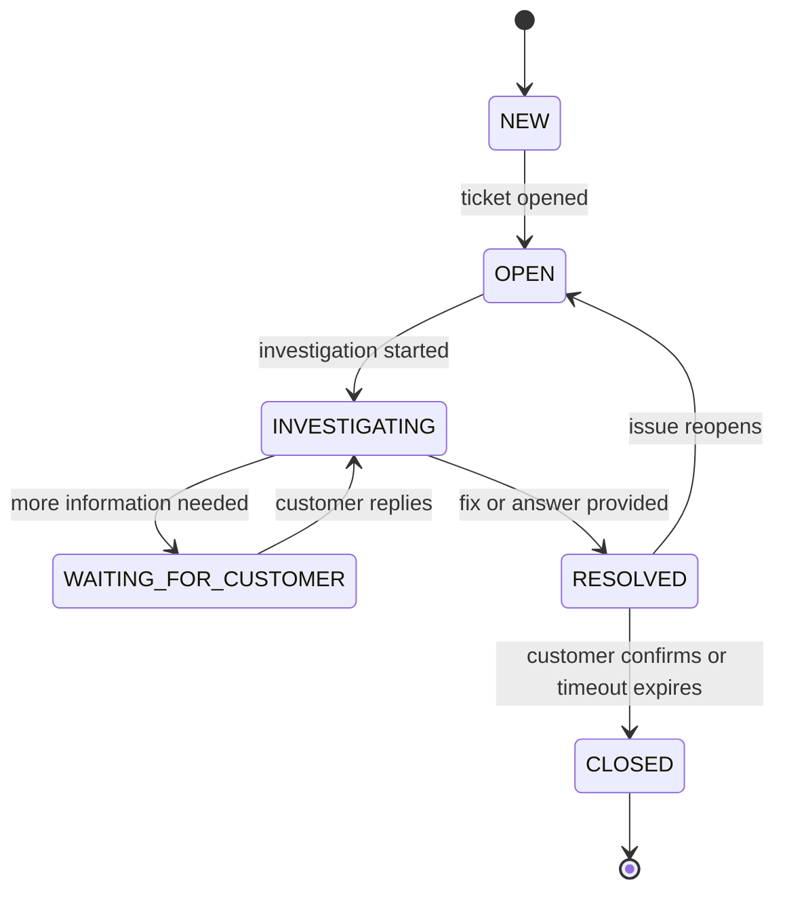
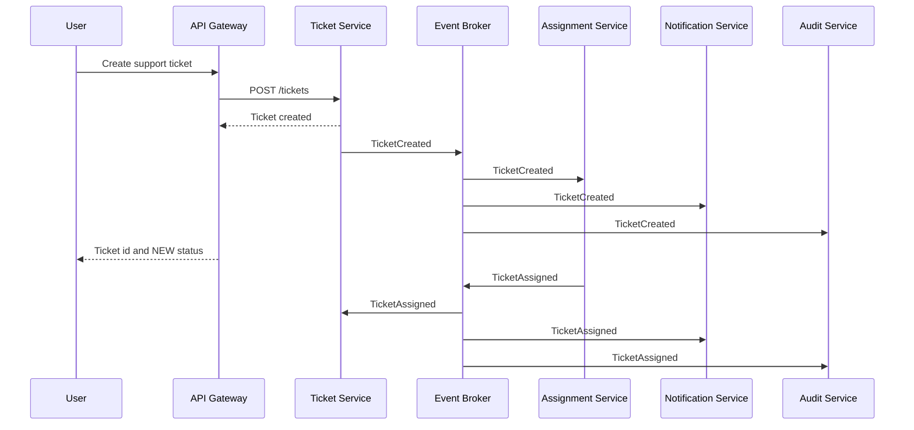
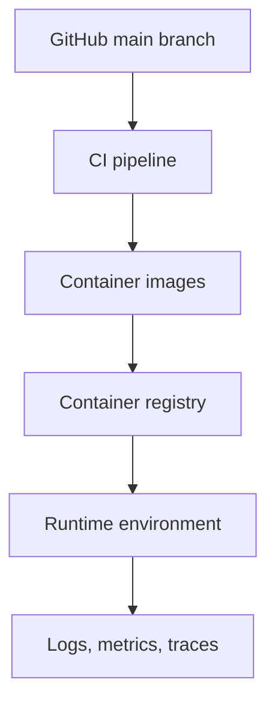

# Final Project Design

This document describes the intended final shape of the Microservices project as
a support-ticket platform. It is a design artifact only; it does not introduce
or require application code changes.

## Product Result

The final project should allow users to create support tickets, track their
status, assign them for investigation, and receive updates as the ticket moves
through its lifecycle.

The current Java prototype models the core ticket behavior. The final design
expands that behavior into independently deployable services with clear data
ownership, API boundaries, and event-based communication.

## Target Repository Shape

```text
Microservices/
|-- docs/
|   |-- architecture.md
|   |-- api-contracts.md
|   |-- deployment.md
|   `-- operations.md
|-- services/
|   |-- ticket-service/
|   |-- customer-service/
|   |-- assignment-service/
|   |-- notification-service/
|   `-- audit-service/
|-- gateway/
|-- infrastructure/
|   |-- docker/
|   |-- database/
|   `-- observability/
|-- tests/
|   |-- contract/
|   `-- integration/
|-- PROJECT_STRUCTURE.md
`-- FINAL_PROJECT_DESIGN.md
```

## Service Architecture



## Service Responsibilities

| Service | Responsibility | Owns Data |
| --- | --- | --- |
| API Gateway | Routes external requests, applies request validation, and provides a stable public API surface. | No |
| Ticket Service | Creates tickets, stores ticket state, and manages lifecycle transitions. | Yes |
| Customer Service | Stores customer profiles and contact preferences. | Yes |
| Assignment Service | Assigns tickets to teams or agents based on rules and workload. | Yes |
| Notification Service | Sends status updates through configured channels. | No |
| Audit Service | Records ticket lifecycle events for traceability and reporting. | Yes |

## Ticket Lifecycle



## Primary Request Flow



## High-Level API Surface

| Endpoint | Owner | Purpose |
| --- | --- | --- |
| `POST /tickets` | Ticket Service | Create a support ticket. |
| `GET /tickets/{id}` | Ticket Service | Read ticket details and current status. |
| `PATCH /tickets/{id}/status` | Ticket Service | Move a ticket through its lifecycle. |
| `POST /tickets/{id}/comments` | Ticket Service | Add a user or agent update to a ticket. |
| `GET /customers/{id}` | Customer Service | Read customer profile data. |
| `POST /assignments` | Assignment Service | Assign a ticket to an owner or queue. |

## Event Contracts

| Event | Producer | Consumers |
| --- | --- | --- |
| `TicketCreated` | Ticket Service | Assignment Service, Notification Service, Audit Service |
| `TicketStatusChanged` | Ticket Service | Notification Service, Audit Service |
| `TicketAssigned` | Assignment Service | Ticket Service, Notification Service, Audit Service |
| `CustomerUpdated` | Customer Service | Ticket Service, Notification Service, Audit Service |

Events should include a stable event id, timestamp, producer name, aggregate id,
event type, and schema version.

## Data Ownership Rules

- Each service owns its database and exposes access through APIs or events.
- No service should read or write another service database directly.
- Cross-service workflows should use events for asynchronous updates.
- User-facing reads can be composed by the API Gateway or a dedicated query view
  when the project needs faster dashboard-style screens.

## Deployment Design



Target deployment characteristics:

- Each service builds and deploys independently.
- Database migrations are versioned per service.
- Configuration is supplied through environment variables or a secret manager.
- Logs include correlation ids so one request can be traced across services.
- Health checks expose readiness and liveness separately.

## Security Design

- External traffic enters through the API Gateway.
- Authentication is verified at the gateway before requests reach services.
- Services authorize actions based on user role and ticket ownership.
- Secrets are never stored in source control.
- Audit events are immutable from the application path.

## Testing Strategy

| Test Type | Goal |
| --- | --- |
| Unit tests | Verify domain rules inside each service. |
| Contract tests | Verify API and event compatibility between services. |
| Integration tests | Verify service behavior with real database and broker dependencies. |
| End-to-end tests | Verify critical user journeys across the deployed system. |

## Final Definition of Done

- Users can create, view, update, assign, and close support tickets.
- Ticket state transitions are validated and auditable.
- Notifications are produced from ticket and assignment events.
- Each service has clear ownership of its data and API surface.
- The system can be built, tested, and deployed from the main branch.
- Architecture, API contracts, deployment, and operations are documented before
  production use.
