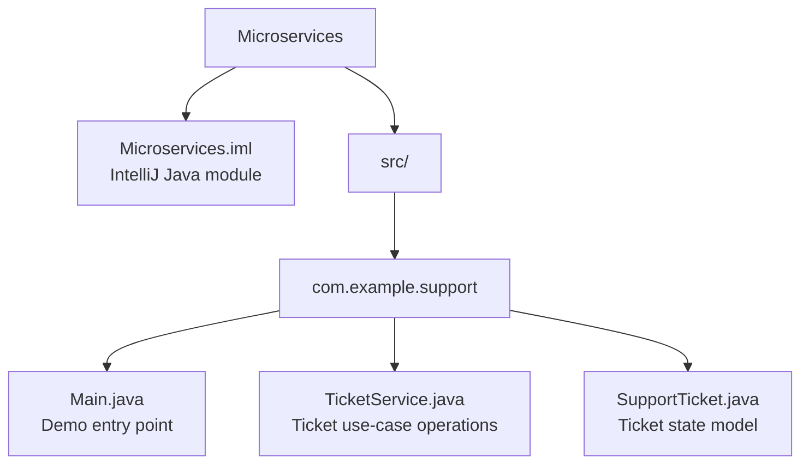
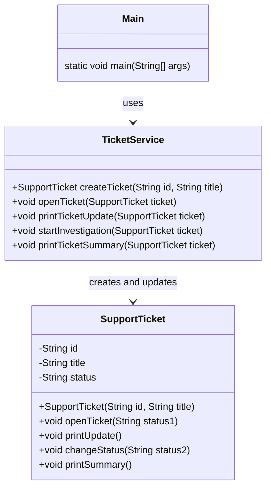
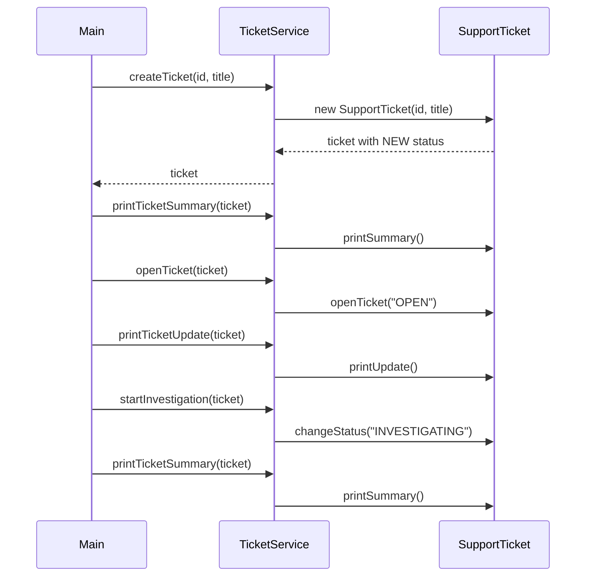

# Project Structure

This repository currently contains a small Java support-ticket service prototype.
The code is organized as a single IntelliJ Java module with source files under
`src/com/example/support`.

## Repository Layout

```text
Microservices/
├── .gitignore
├── LICENSE
├── Microservices.iml
├── PROJECT_STRUCTURE.md
└── src/
    └── com/
        └── example/
            └── support/
                ├── Main.java
                ├── SupportTicket.java
                └── TicketService.java
```

## Source Package Map



## Current Design



## Runtime Flow



## Component Responsibilities

| File | Responsibility |
| --- | --- |
| `Main.java` | Demonstrates the ticket lifecycle by creating a ticket, printing it, opening it, and moving it into investigation. |
| `TicketService.java` | Provides the application-level operations for creating and updating support tickets. |
| `SupportTicket.java` | Stores ticket data and owns the current ticket status. |

## Design Notes

- The current code is a single Java module, not yet split into separately deployed services.
- `TicketService` acts as the service layer around the `SupportTicket` domain object.
- `SupportTicket` currently prints directly to standard output; future service boundaries may move presentation and logging outside the domain model.
- The ticket lifecycle currently uses string statuses: `NEW`, `OPEN`, and `INVESTIGATING`.
